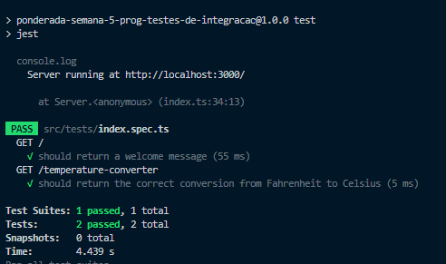
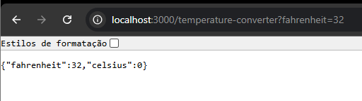
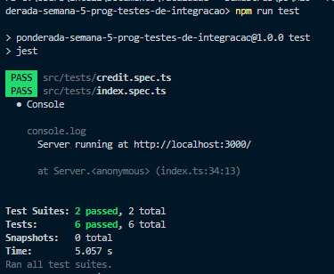

# Testes da API

## Testes de Integração

Os testes de integração verificam a interação entre diferentes partes da aplicação, como rotas, middlewares e funções do servidor. O objetivo é garantir que todos os componentes da aplicação trabalhem de maneira coesa.

### Cenário 1: Teste da Rota Principal
O teste verifica se a rota `/` retorna a mensagem de boas-vindas corretamente.

#### Código do Teste
```ts
describe('GET /', () => {
  it('should return a welcome message', async () => {
    const response = await request(server).get('/');
    expect(response.status).toBe(200);
    expect(response.text).toBe('Hello, Express with TypeScript!');
  });
});

```

### Cenário 2: Teste da Rota de Conversão de Temperatura

O teste verifica se a conversão de Fahrenheit para Celsius está sendo realizada corretamente.

#### Código do Teste

```ts
describe('GET /temperature-converter', () => {
  it('should return the correct conversion from Fahrenheit to Celsius', async () => {
    const response = await request(server).get('/temperature-converter?fahrenheit=32');
    expect(response.status).toBe(200);
    expect(response.body.fahrenheit).toBe(32);
    expect(response.body.celsius).toBe(0);
  });
});

```

Resultado Esperado

A conversão de 32°F para Celsius deve resultar em 0°C.






### Cenário 3: Teste de Análise de Crédito

Este teste garante que o serviço de análise de crédito retorne o status correto com base em diferentes cenários de CPF.

#### Código do Teste

```ts
describe('Test Credit Analysis', () => {
    const testCreditAnalysis = new TestCreditAnalysis();

    it('should return Invalid Parameter for an invalid CPF', () => {
        return testCreditAnalysis.testInvalidCPF();
    });

    it('should return Communication Error for a communication error CPF', () => {
        return testCreditAnalysis.testCommunicationError();
    });

    it('should return No Pending for a CPF with no pending debts', () => {
        return testCreditAnalysis.testNoPendingCPF();
    });

    it('should return Due for a CPF with pending debts', () => {
        return testCreditAnalysis.testDueCPF();
    });
});


```

Resultado Esperado:

Cada status de CPF é verificado para garantir que o serviço responde corretamente a diferentes cenários de crédito, como CPF inválido, erro de comunicação, sem pendências e com dívidas em atraso.



